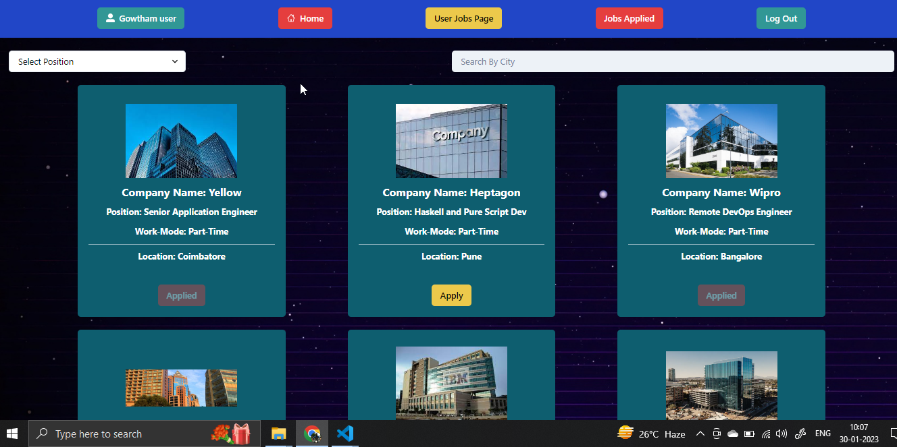

 <!-- Ctrl + Shift + P + markdown -->
 <h1>MERN-STACK JOB-SEARCH-APP</h1>
<h4>
This is MERN stack job search website, a complete solution for job seekers and employers. With a user-friendly front-end design, made with React-Chakra UI and state is efficiently managed through Redux store. And Backend is features advanced backend technology with MongoDB, Node.js, Express, and Mongoose, ensuring seamless data storage and API operations and with this advanced security measures implemented in the backend.
   
Using JWT and password hashing with Node.js and Express.js, sensitive user data is protected.

Job seekers can easily search and filter job listings based on role and city on the user job search page. Employers have the ability to post, edit, and delete job listings through the exclusive admin dashboard.

Job seekers can view, apply, edit, and delete their job applications on the "Applied Jobs" page. With the added ability to search and filter job listings, our website offers a convenient and efficient solution for all your job search needs.

</h4>
 

<h2><i>🎯 Using Languages & Tools 🧰</i></h2>
 

   
   
   
    
    
    
    
    
     
    
 
 
 

 

🎯## Project is live at 🔗
**[Job-Search-App](https://mern-job-search-app.netlify.app)**
 

🎯 Features

- Responsive Laniding Page.
- Login/Signup page.
- JobSearch page which displays all the job posted by admin.
- User can apply job and it will add to apllied job page.
- User can able to edit, delete the job which are applied
- Admin dashboard used to post the new job
- Job Search Functionlity
- Created the Api for jobPosting,Jobgeting
- Implemented JWT for authentication and authorization.
- ## Dependencies:

### Front-end

    1) react
    2) react-dom
    3) react-scripts
    4) styled-components
    5) react-router-dom
    6) react-icons
    7) Chakra-UI
    8) react-multi-carousel
    9) react-countdown
    10) axios
    11) redux, redux thunk, react-redux

### Backend

    1) express
    2) cors
    3) dotenv
    4) mongoose
    5) nodemon

## Landing Page

 

## Job Search Page

  

## Job Applied Page

 

##  Admin DashBoard Page

  

## Admin Joblisting Page

 

## login Page

 

## Setting Up Project in local

### Frontend

#### 1) Setting up node environment

    1) navigate to Frontend directory
    2) use node version 16 or 18.12.1 is recommended
    3) run command npm install or npm i --legacy-peer-deps it will install all the required Dependencies with no errors.

#### 2) Starting frontend on localhost

(make sure you are confirming url of server)

    npm start /*or*/ npm run start

#### 3) Making Production ready folder

    npm run build

### Server

#### 1) Setting up node environment

    1) navigate to Backend directory
    2) use node version 16 or 18.12.1 is recommended
    3) run command npm install or npm i --legacy-peer-deps

#### 1) Starting Server in deployment

    npm start

#### 1) Starting Server with nodemon on locahost

    npm run dev

### Database: MongoDB

#### 1) Atlas

    in .env file provide MONGODB_URL with proper credentials

#### 2) Local database

    if MONGODB_URL not declared in .env, by default it will connect to local data base

    in case not working try changing MONGODB_URL by creating your own in MongoDB Atlas server
